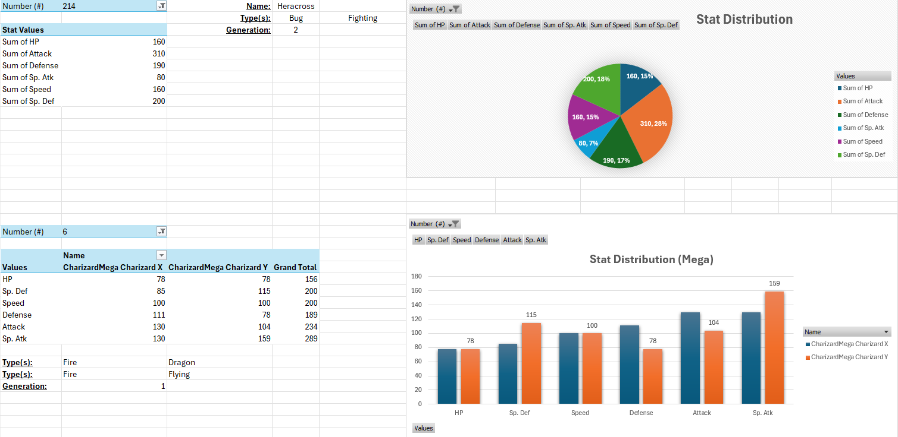
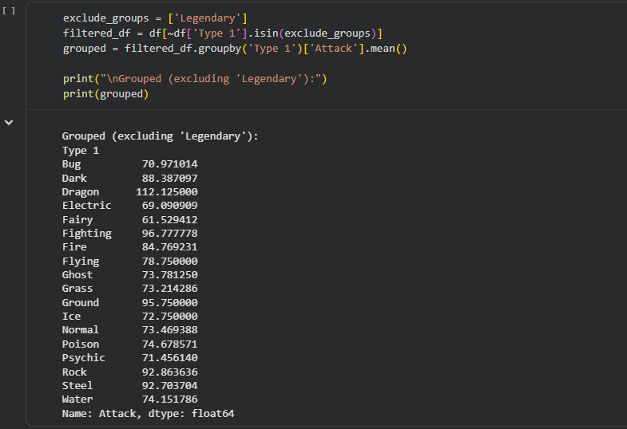

# 📊 Pokémon Statistics Dashboard Analysis
Pokémon Statistics Dashboard (Excel + Python)

This project explores Pokémon statistics through an interactive Excel dashboard and Python-based data analysis. The dashboard allows users to compare Pokémon attributes, analyse stat distributions, and evaluate different forms such as Mega Evolutions. Python was used alongside Excel to perform additional statistical analysis and validate insights from the dataset.

My Excel file can be found clicking here - [Pokémon Dashboard](Pokemon_Dataset.xlsx)
## 📌 Project Overview

The objective of this project was to transform raw Pokémon data into an interactive dashboard that highlights individual Pokémon strengths and enables meaningful comparisons across different generations, types, and evolutions.

The dashboard combines Excel PivotTables, PivotCharts, filters, and slicers with Python for deeper statistical exploration.

## 🛠️ Tools Used
Microsoft Excel
Pivot Tables
Pivot Charts
Filters
Dashboard Design
Python
Pandas
Data Grouping & Aggregation
Pokémon Dataset (Generation 1–6)
## 📊 Dashboard Features
1. Individual Pokémon Stat Analysis

Users can select a Pokémon by its Pokédex number to instantly display:

HP
Attack
Defense
Special Attack
Special Defense
Speed
Generation
Primary & Secondary Type

Example shown:

Heracross (#214)

Stat	Value
HP	160
Attack	310
Defense	190
Special Attack	80
Speed	160
Special Defense	200

The accompanying pie chart visualizes how each stat contributes to the Pokémon's overall stat distribution, making it easy to identify dominant strengths. For Heracross, Attack is the highest attribute, confirming its role as a physical attacker.

2. Mega Evolution Comparison

The dashboard compares multiple forms of the same Pokémon.

Example:

Mega Charizard X
Mega Charizard Y

The clustered column chart highlights the differences between both Mega Evolutions.

## Key observations:

Mega Charizard X has:
Higher Attack
Higher Defense
Mega Charizard Y has:
Significantly higher Special Attack
Better Special Defense
Both share identical HP and Speed values.

This comparison clearly demonstrates how each Mega Evolution serves a different battle strategy.

## 🐍 Python Analysis

Python was used to perform additional statistical analysis beyond Excel's dashboard capabilities.

Example analysis:

exclude_groups = ['Legendary']

filtered_df = df[~df['Type 1'].isin(exclude_groups)]

grouped = filtered_df.groupby('Type 1')['Attack'].mean()

This analysis calculates the average Attack stat for each primary Pokémon type while excluding Legendary Pokémon.

Results
Type	Average Attack
Dragon	112.13
Fighting	96.78
Ground	95.75
Rock	92.86
Steel	92.70
Dark	88.39
Insights
Dragon-type Pokémon possess the highest average Attack among non-Legendary Pokémon.
Fighting and Ground types consistently rank among the strongest physical attackers.
Fairy and Electric types exhibit comparatively lower average Attack values, reflecting their greater reliance on Special Attack or supportive roles.

Python complements the Excel dashboard by enabling efficient grouping, filtering, and statistical calculations that can be extended to more advanced analyses.

## 📈 Key Insights
Attack is the dominant attribute for Heracross, making it a strong physical attacker.
Mega Charizard X focuses on physical offense and defensive durability.
Mega Charizard Y specializes in powerful special attacks with improved Special Defense.
Dragon-type Pokémon exhibit the highest average Attack among non-Legendary Pokémon.
Combining Excel dashboards with Python analytics provides both interactive visualization and scalable data exploration.
## 💡 Skills Demonstrated
Data Cleaning
Data Transformation
Pivot Tables
Pivot Charts
Interactive Dashboard Design
Statistical Analysis
Python (Pandas)
Data Aggregation
Data Visualization
Analytical Reporting
