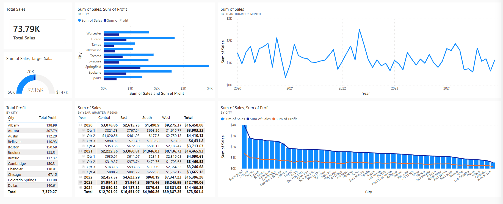

# 📊 Sales Performance Dashboard Analysis | Power BI

This dashboard provides a comprehensive overview of sales and profitability across different cities, regions, and time periods. It enables decision-makers to monitor business performance, identify high-performing locations, and uncover opportunities for growth.

## Dashboard File
A link to the dashboard can be found here: https://app.powerbi.com/groups/me/dashboards/d9c0c4af-7114-41fa-a314-d42f6a86d1f2?experience=power-bi
## 📌 Dashboard Overview
Key KPI
Total Sales: 73.79K

Target Achievement: 73.5K / 147K (~50%)

Total Profit: 7.38K

The dashboard indicates that while the business has generated respectable sales, it has achieved only about 50% of its target, suggesting there is significant room for improvement.

## 📈 Sales Trend Analysis (2020–2024)

The monthly sales trend reveals several important patterns:

Sales fluctuate between $500 and $2.5K monthly

The highest sales peak occurred during 2022, reaching approximately $2.5K

Sales remain relatively stable but volatile, with no consistent upward growth trend

2024 continues to show fluctuations without sustained momentum

Key Insight:

The business experiences irregular demand rather than steady growth. Investigating seasonal factors or promotional campaigns during peak months could help replicate successful periods.

## 🌍 Regional Performance
| Region	| Total Sales |
|---------|-------------|
| West | 39.39K |
| East	| 16.45K |
| Central	| 12.70K |
| South	| 4.96K |

Observations:

- The West region contributes over half of total revenue.
- East performs moderately well.
- South significantly underperforms compared to other regions.

## Recommendation

Focus on understanding why the West region outperforms others and apply similar strategies to weaker regions, particularly the South.

## 🏙️ City Performance

The city comparison highlights the strongest contributors.

| Top Performing Cities |
| -------------- |
| Springfield |
| Tucson |
| Spokane |
| Tacoma |
| Syracuse |

| Lower Performing Cities |
| -------- |
| Henderson |
| Orlando |
| Miami |
| Dallas |
| Vallejo |

Sales and profit generally move together, indicating that higher sales usually generate higher profits.

## Key Insight:

Some cities generate substantial revenue while contributing comparatively less profit. These locations may have:
- Higher operating costs
- Larger discounts
- Lower-margin products

These cities deserve further profitability analysis.

## 💰 Profit Analysis

Total Profit: 7.38K

The city-level profit table shows noticeable differences:

| Highest visible profits |
| ----------- |
| Aurora |
| Boston |
| Cambridge |
| Albany |

Although profits are positive overall, the margin remains relatively modest compared to total sales.

Estimated Profit Margin: ≈10%

This suggests opportunities to improve profitability through:

- Pricing optimization
- Discount management
- Better product mix
- Operational efficiency
## 🎯 Target Performance

The gauge indicates:

Current Sales: 73.5K
Target: 147K

Achievement: ≈50% of target

This is one of the most important KPIs in the dashboard and signals that additional sales initiatives are required to meet business objectives.

Possible actions include:

- Increasing customer acquisition
- Running targeted promotions
- Expanding high-performing product lines
- Improving sales coverage in weaker regions
## 📊 Overall Insights
Strengths:
- Strong performance in the West region.
- Consistent positive profitability.
- Several cities contribute significantly to overall revenue.
- Sales remain relatively stable across multiple years.

Weaknesses:

- Only 50% of the sales target has been achieved.
- South region lags considerably.
- Monthly sales exhibit high volatility.
- Profit margins appear modest relative to sales.

## 📌 Conclusion

The dashboard provides a clear picture of business performance across sales, profit, regions, cities, and time. While the company maintains steady sales and positive profitability, it is currently achieving only around half of its sales target. The West region drives most of the revenue, whereas the South region presents the greatest opportunity for growth. By improving regional performance, optimizing profit margins, and replicating successful sales strategies, the business can move closer to achieving its overall objectives.

## Tools Used: 
- Power BI
- DAX •
- Data Modeling
- Interactive Visualizations
- KPI Cards
- Line Charts
- Bar Charts
- Gauge Chart
- Matrix Table
