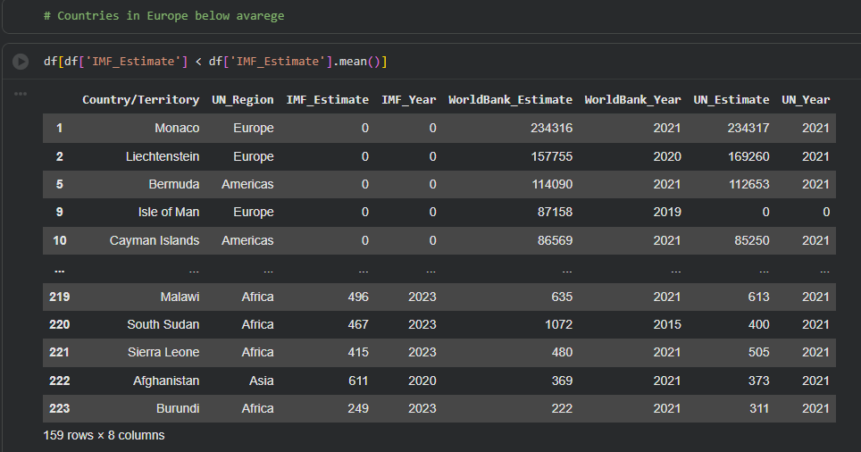
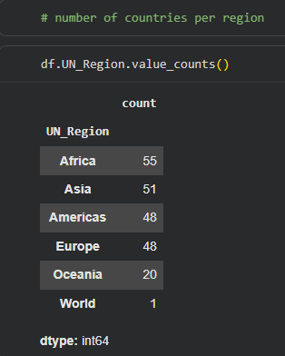

# 📊 Exploratory Data Analysis (EDA) of GDP per Capita Dataset with Pandas

In this project, I performed a simple **Exploratory Data Analysis (EDA)** on a GDP per capita dataset using **Python** and **Pandas** in Google Colab. The objective was to understand the dataset structure and practice filtering data based on statistical conditions.

---

## 📂 Loading the Dataset

The dataset was uploaded into Google Colab using the built-in upload widget.

```python
from google.colab import files
uploaded = files.upload()
```

After uploading, the CSV file was loaded into a Pandas DataFrame.

```python
df = pd.read_csv(
    "GDP (nominal) per Capita.csv",
    encoding='unicode_escape',
    index_col=0
)
```

### What this does

* `pd.read_csv()` reads the CSV file.
* `encoding='unicode_escape'` prevents encoding errors caused by special characters.
* `index_col=0` uses the first column as the DataFrame index.

---

## 📊 Exploring the Dataset

Displaying the DataFrame gives an overview of the data.

```python
df
```

The dataset contains **223 countries/territories** and **8 columns** including:

* Country/Territory
* UN Region
* IMF Estimate
* IMF Year
* World Bank Estimate
* World Bank Year
* UN Estimate
* UN Year

This provides GDP per capita estimates from three different international organizations.

---

## 📈 Filtering Countries Below the Average IMF Estimate

The following code filters every country whose IMF GDP per capita estimate is lower than the dataset's average.

```python
df[df["IMF_Estimate"] < df["IMF_Estimate"].mean()]
```

### How it works

The expression

```python
df["IMF_Estimate"].mean()
```

calculates the average GDP per capita across all countries.

Next,

```python
df["IMF_Estimate"] < df["IMF_Estimate"].mean()
```

creates a Boolean mask.

Example:

```text
True
False
True
True
...
```

Finally,

```python
df[mask]
```

returns only the rows where the condition is `True`.

---

## ⚠️ Observation

The filtered results include countries such as:

* Monaco
* Liechtenstein
* Bermuda
* Cayman Islands

These countries appear because their **IMF_Estimate is recorded as 0**, indicating **missing or unavailable IMF data**, rather than an actual GDP per capita of zero.

This means the average is influenced by placeholder values.

---

## 💡 Better Approach

Before calculating the average, replace placeholder zeros with missing values.

```python
import numpy as np

df["IMF_Estimate"] = df["IMF_Estimate"].replace(0, np.nan)

below_average = df[df["IMF_Estimate"] < df["IMF_Estimate"].mean()]
```

This produces a more accurate comparison because missing data no longer affects the mean.

---

## 📌 Key Pandas Concepts Used

* Reading CSV files with `pd.read_csv()`
* Viewing DataFrames
* Calculating averages with `.mean()`
* Boolean indexing
* Filtering rows
* Handling missing values
* Basic exploratory data analysis (EDA)

---

## 🚀 Conclusion

This analysis demonstrates the fundamentals of EDA using Pandas. By loading the dataset, inspecting its structure, and filtering countries based on the average IMF GDP per capita, we gain initial insights into the data. It also highlights an important lesson in data analysis: **always inspect your dataset for placeholder values (such as `0`) before performing statistical calculations**, as they can lead to misleading results.

