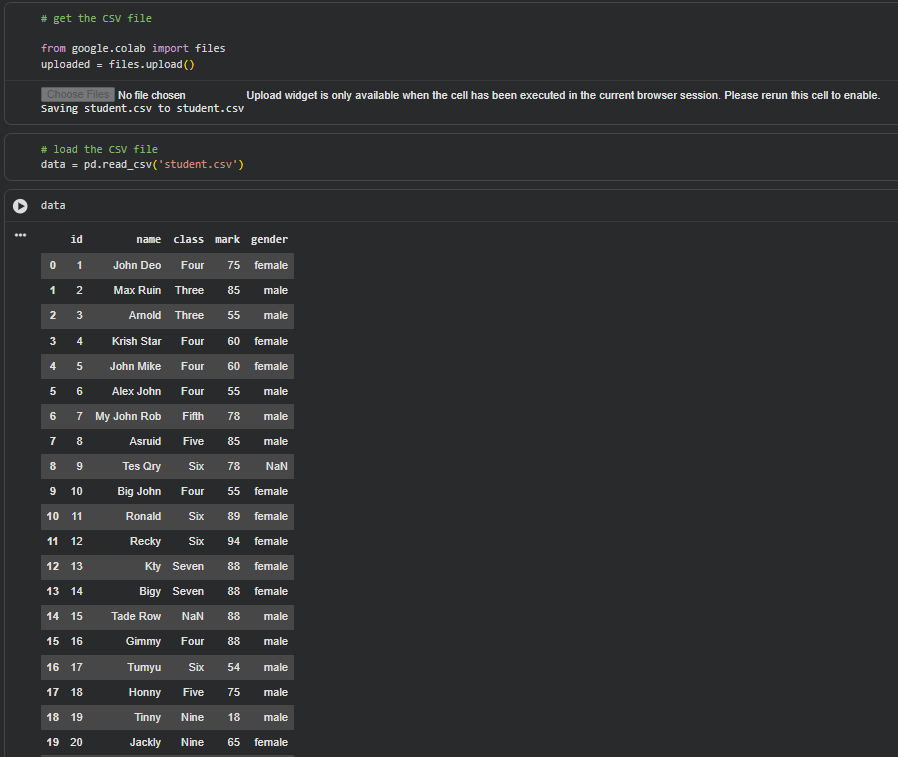
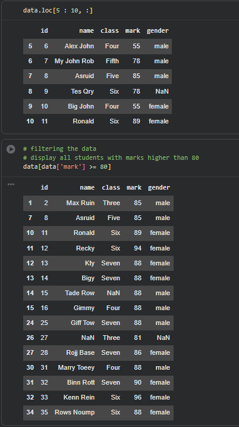

# Student Performance Analysis with Python and Pandas

This project demonstrates a simple exploratory data analysis workflow using **Python** and **Pandas**. The dataset contains student details such as ID, name, class, mark, and gender.

## 1. Uploading and Loading the Dataset

```python
from google.colab import files

uploaded = files.upload()
data = pd.read_csv("student.csv")
```

The CSV file is uploaded in Google Colab and loaded into a Pandas DataFrame named `data`.

> Note: `pandas` must be imported first:

```python
import pandas as pd
```

## 2. Understanding the Dataset

The DataFrame contains columns similar to:

- `id`
- `name`
- `class`
- `mark`
- `gender`

Displaying the DataFrame is a useful first step because it helps identify data-quality issues. In this dataset, some values are missing, including entries in the `name`, `class`, and `gender` columns.

Useful checks would include:

```python
data.info()
data.isna().sum()
data.duplicated().sum()
```

These commands reveal column types, missing values, and duplicated rows.


## 3. Renaming the Marks Column

```python
data.rename(columns={"mark": "scores"}, inplace=True)
```

This changes the column name from `mark` to `scores`. Renaming can make a dataset easier to understand, but the new name must be used consistently in all later code.

For example:

```python
data["scores"].mean()
data[data["scores"] > 80]
```

The screenshots later refer to `data["mark"]`, which would raise a `KeyError` if those cells were run after the rename in the same notebook session. This suggests that the cells may have been executed in a different order or that the DataFrame was reloaded.

## 4. Descriptive Statistics

```python
data["scores"].describe()
```

The output summarizes 35 score values:

| Statistic | Value |
|---|---:|
| Count | 35 |
| Mean | 74.66 |
| Standard deviation | 16.40 |
| Minimum | 18 |
| 25th percentile | 62.50 |
| Median | 79 |
| 75th percentile | 88 |
| Maximum | 96 |

### Interpretation

The average score is approximately **74.66**, while the median is **79**. Because the mean is lower than the median, one or more low scores—especially the minimum score of **18**—appear to pull the average downward.

The middle 50% of scores lie between **62.5 and 88**, giving an interquartile range of:

```text
IQR = 88 - 62.5 = 25.5
```

The standard deviation of approximately **16.40** indicates that scores are spread fairly widely around the mean.

## 5. Calculating Individual Statistics

### Mean

```python
round(data["scores"].mean(), 2)
```

Result:

```text
74.66
```

### Maximum

```python
data["scores"].max()
```

Result:

```text
96
```

### Minimum

```python
data["scores"].min()
```

Result:

```text
18
```

### Median

```python
data["scores"].median()
```

Result:

```text
79.0
```

### Standard Deviation

```python
data["scores"].std()
```

Result:

```text
16.4011...
```

Pandas uses the **sample standard deviation** by default (`ddof=1`). To calculate the population standard deviation, use:

```python
data["scores"].std(ddof=0)
```

## 6. Selecting Rows with `.loc`

```python
data.loc[5:10, :]
```

This selects rows whose index labels range from **5 through 10**.

An important detail is that `.loc` includes both endpoints, so six rows are returned. This differs from standard Python slicing, where the ending position is normally excluded.

A clearer equivalent is:

```python
data.loc[5:10]
```

For position-based slicing, use `.iloc`:

```python
data.iloc[5:11]
```

## 7. Filtering High-Scoring Students

```python
data[data["scores"] > 80]
```

This returns students whose scores are strictly greater than 80.

The condition does **not** include students who scored exactly 80. To include them, use:

```python
data[data["scores"] >= 80]
```

A more readable alternative is:

```python
high_scorers = data.query("scores > 80")
```

The filtered result shows several students scoring between 81 and 96. Missing values in unrelated columns do not prevent filtering because the condition only depends on the score column.

## 8. Data-Quality Improvements

Before drawing stronger conclusions, the dataset should be cleaned.

### Standardize column names

```python
data.columns = data.columns.str.strip().str.lower()
```

### Check missing values

```python
data.isna().sum()
```

### Remove rows without a score

```python
data = data.dropna(subset=["scores"])
```

### Fill missing categorical values

```python
data["gender"] = data["gender"].fillna("Unknown")
data["class"] = data["class"].fillna("Unknown")
```

### Ensure scores are numeric

```python
data["scores"] = pd.to_numeric(data["scores"], errors="coerce")
```

### Check score validity

```python
invalid_scores = data[~data["scores"].between(0, 100)]
```

## Conclusion

This notebook successfully demonstrates the foundations of data analysis with Pandas: loading a CSV file, renaming columns, calculating descriptive statistics, selecting rows, and filtering records.

The strongest result is the summary of student scores: the dataset has an average of **74.66**, a median of **79**, and scores ranging from **18 to 96**. The main improvement needed is consistency after renaming `mark` to `scores`, followed by more systematic handling of missing values.

With a small amount of cleaning and visualization, this can become a clear and reusable beginner-level data analysis project.
