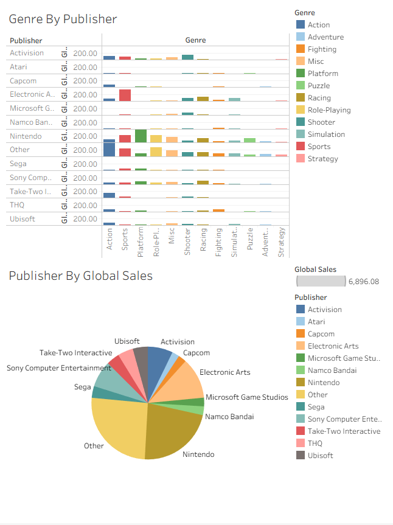

#🎮 Video Game Sales & Publisher Analysis Dashboard

## 📊 Video Game Industry Analysis (1980–2010)
I built this Tableau dashboard to explore global video game sales, publisher performance, release trends, and genre distribution. The dashboard provides insights into how the gaming industry evolved over three decades and highlights which publishers dominated the market.

## 🔍 Key Insights
1. Nintendo dominates publisher sales

The Global Sales per Publisher chart clearly shows Nintendo as one of the strongest individual publishers, second only to the aggregated "Other" category.

## Observations:

Nintendo consistently outperformed most major publishers.
Electronic Arts, Sony Computer Entertainment, Activision, Ubisoft, and Sega also contributed significantly to global sales.
The large "Other" category suggests the industry is highly fragmented with many smaller publishers collectively accounting for a substantial share of sales.
2. Massive industry growth after the mid-1990s

The Video Game Releases Per Year line chart reveals how rapidly the industry expanded.

## Key trends:

Very few games were released during the early 1980s.
Releases began increasing steadily during the 1990s.
A dramatic surge occurred between 2000 and 2008, where annual releases exceeded 1,400 titles.
After 2008, releases declined slightly, possibly reflecting market saturation and the transition to newer console generations.

This growth aligns with the rise of:

PlayStation
Xbox
Nintendo Wii
PC gaming
Digital distribution
3. Publishers increased production over time

The small multiple line charts (Publisher Releases Per Year) show release trends for each publisher.

Some notable observations include:

Activision experienced strong growth in the mid-to-late 2000s.
Electronic Arts maintained consistently high release volumes throughout the 2000s.
Ubisoft expanded rapidly after the late 1990s.
Nintendo exhibited more variation, focusing on quality over quantity.
Smaller publishers maintained relatively stable release numbers.

Overall, nearly every major publisher increased output as the gaming market expanded.

4. Genre preferences vary by publisher

The Genre by Publisher heatmap highlights how publishers specialize in different game genres.

Examples include:

Nintendo:
Strong emphasis on Platform games
Significant presence in Puzzle and Role-Playing titles

Electronic Arts:
Heavy concentration in Sports games
Presence across Racing and Action genres

Activision:
Strong focus on Action and Shooter titles

Capcom:
Balanced portfolio with Fighting, Action, and Adventure games

Rather than competing in every genre equally, publishers tend to build expertise around specific audiences.

5. Market share distribution

The pie chart reinforces the dominance of a handful of publishers.

Although many companies participate in the industry, publishers like:

Nintendo
Electronic Arts
Sony Computer Entertainment
Activision
Ubisoft

capture a significant proportion of total global sales.

Meanwhile, the collective Other category demonstrates the competitive nature of the gaming market, where numerous smaller publishers contribute meaningful sales despite lacking individual dominance.

## 📈 Overall Conclusions

The dashboard reveals several major trends:

📈 The video game industry experienced explosive growth after the late 1990s.
🎮 Nintendo emerged as one of the most successful publishers in terms of global sales.
🏢 Publishers steadily increased game production to meet growing market demand.
🎯 Genre specialization appears to be a common strategy among major publishers.
🌍 Despite dominant companies, the market remains diverse due to many smaller publishers.

These findings illustrate both the rapid expansion of the gaming industry and the strategic differences between publishers that helped shape today's gaming landscape.

## 🛠️ Dashboard Features
Global Sales by Publisher
Video Game Releases by Year
Publisher Release Trends
Genre Distribution by Publisher
Publisher Market Share Analysis

## Tools Used

Tableau
Video Game Sales Dataset
Data Cleaning & Aggregation
Interactive Dashboard Design
